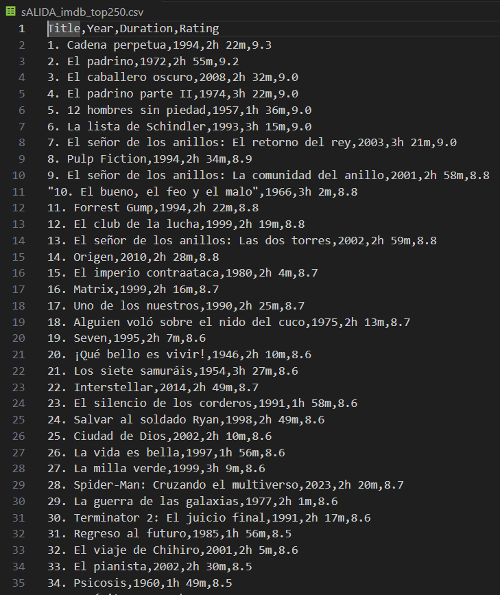

# web_Scraping

## Enuciado:

El objetivo de esta tarea es hacer scraping en la página web www.IMDB.com, pero previamente, para aprender los conceptos básicos de dicha técnica, vamos a leer un tutorial en línea: https://www.ionos.es/digitalguide/paginas-web/desarrollo-web/web-scraping-con-python/ (1). Los conocimientos adquiridos en dicho tutorial los podemos aplicar en páginas fake que existen para tal fin (scraping), por ejemplo, http://books.toscrape.com/catalogue/category/books/art_25/index.html

Este código en Python está diseñado para extraer información de la página de IMDb Top 250 y almacenarla en un archivo CSV. Aquí te explico paso a paso lo que hace el código:

### Importación de módulos:

Se importan los módulos necesarios para realizar la extracción de datos (requests y BeautifulSoup), trabajar con datos (pandas), y expresiones regulares (re).

### URL y Headers: 
Se define la URL de la página de IMDb Top 250 y los headers para simular una solicitud HTTP como si proviniera de un navegador web.
Solicitud HTTP: Se realiza una solicitud a la página de IMDb usando requests.get con la URL y los headers definidos.
Verificación de la respuesta: Se verifica si la solicitud fue exitosa comprobando el código de estado. Si es 200, significa que la solicitud fue exitosa.

### Parseo de HTML: 
Se utiliza BeautifulSoup para analizar el contenido HTML de la respuesta y poder navegar por sus elementos.

### Extracción de datos: 
Se busca la sección que contiene la lista de películas y se itera sobre cada elemento de la lista para extraer los títulos, años, duraciones y calificaciones.

### Almacenamiento de datos: 
Se almacenan los datos extraídos en listas y luego se crean un DataFrame de pandas con estos datos.

### Creación de archivo CSV: Se guarda el DataFrame en un archivo CSV llamado ‘imdb_top250.csv’.

###Impresión de información: 
Se imprime información sobre el DataFrame y las primeras entradas para verificar que los datos se han recopilado correctamente.

El código también incluye una línea print(rating_element) que parece ser un error o una línea de depuración, ya que imprimirá el elemento HTML de la calificación, lo cual no es útil en el contexto del script.

Si el código se ejecuta correctamente, deberías obtener un archivo CSV con los datos de las películas del Top 250 de IMDb y ver la información del DataFrame impresa en la consola. Si hay un error al obtener la página, se imprimirá un mensaje de error con el código de estado de la respuesta HTTP.
